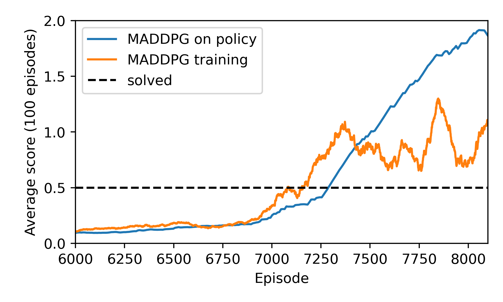

# Udacity DRLND

## [Report](./Report.md)

## P3 Multi Agent
Read about the project / environment [here](./UdacityP3MultiAgent.md).

## Project Details


## Getting Started
1. Python Environment

The `setup_env.sh` script can be used to create and configure an environment with all the required dependencies to run the included code. The script assumes `conda` is available. The script requires 1 argument, which is the name that will be given to the created conda environment. E.g. `./setup_env.sh drlnd` will create a conda environment named 'drlnd' in which all the included code and programs should run. Alternatively, 
a `Dockerfile` is included, along with some pre-baked scripts that can run/train
the agent in a `docker` container.

2. Commons Code

The project depends on some commons code which is shared between this project and
another project forming part of the nanodegree. The code is included in this
repository as a submodule. You can simply fetch the `master` branch of the submodule
and install the package with pip, or run:

`pip install git+https://github.com/kyle-jarvis/drlnd-common.git@master#egg=drlnd-common`

## Instructions
The `multi_agent.py` file exposes a CLI build with `click`. The following
commands are available:

```
python multi_agent.py --help
Usage: multi_agent.py [OPTIONS] COMMAND [ARGS]...

Options:
  --help  Show this message and exit.

Commands:
  run    Initialise an agent using pre-trained network weights and observe...
  train  Train a pair of agents to play tennis using the MADDPG algorithm.
```

### Training an agent

```
python ./multi_agent.py train --help
Usage: multi_agent.py train [OPTIONS]

  Train a pair of agents to play tennis using the MADDPG algorithm.

Options:
  --n-episodes INTEGER  Number of episodes to train for.
  --note TEXT           Note to record to .txt file when results are saved.
  --help                Show this message and exit.
```

E.g.

`python multi_agent.py train --n-episodes 500`

### Running a trained agent

```
python ./multi_agent.py run --help
Usage: multi_agent.py run [OPTIONS]

  Initialise an agent using pre-trained network weights and observe the
  agent's interaction with the environment.

Options:
  --weights-path TEXT   Path to the directory containing the trained weights
                        of the agents networks. Can be none, in which case the
                        pre-trained weights in resources are used.

  --n-episodes INTEGER  Number of episodes to train an agent for.
  --help                Show this message and exit.
```

E.g. Run a trained agent (included weights in resources) for 5 agents.

`python multi_agent.py run --n-episodes 5`

## Results

Using the MADDPG algorithm the pair of agents are eventually able to establish
long rallys, for which they receive higher cumulative rewards. Training proceeds
in a stable fashion, and for the training curve below, training was terminated prematurely
because the length of the rallies between agents had caused the episode length to
dramatically increase!

See the [report](Report.md) for a discussion on the below training trajectory.



Below is a GIF of the trained agents playing a game of 'tennis'. Agents receive a positive reward for 'returning' the ball, and a negative reward for 'dropping' the ball.


